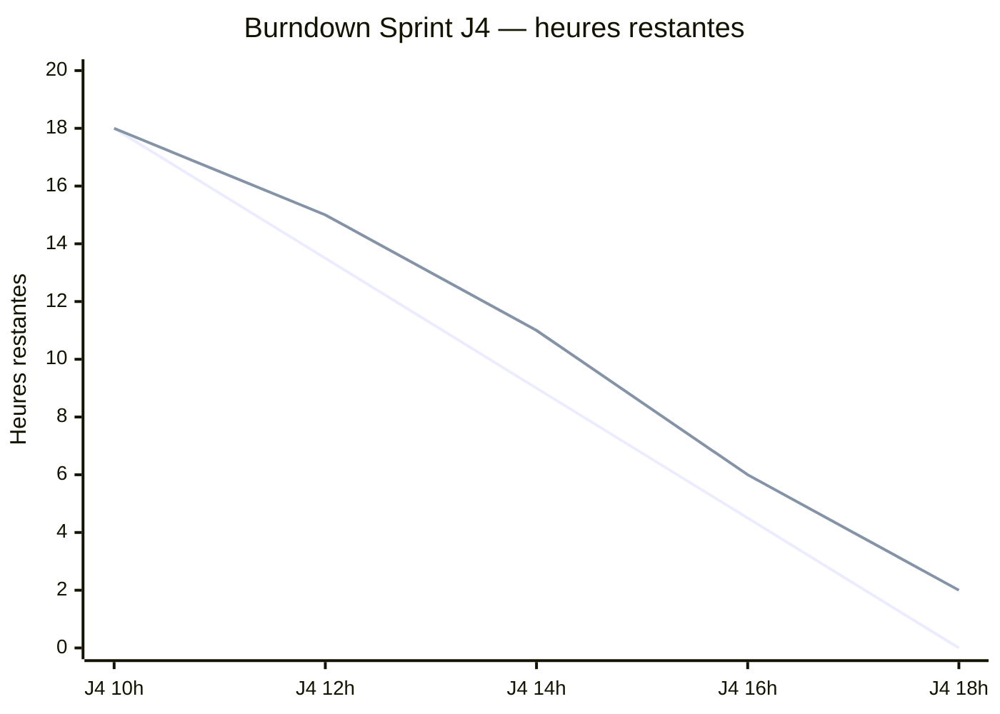
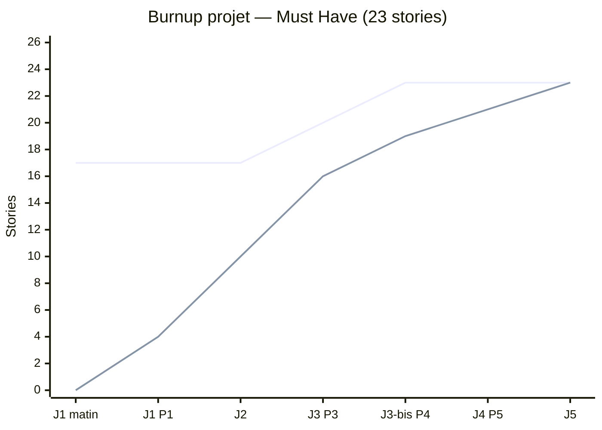
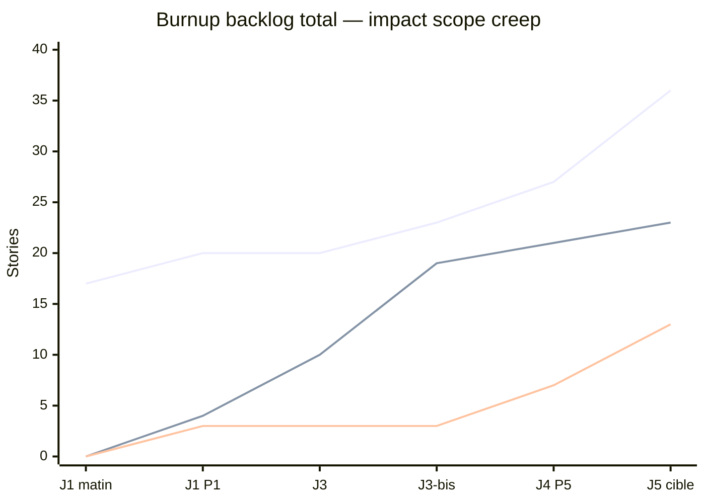

# Pilotage J4 — Burndown & Burnup

**Projet :** EduTutor IA — Équipe 22  
**Date :** Jeudi 2 juillet 2026 (perturbation P5 — Livraison / Crise)  
**Source périmètre :** Story Map finale (11 activités, post-perturbations J1 → J4)

---

## 1. Synthèse du périmètre

La Story Map distingue trois niveaux de priorisation MoSCoW :

| Zone | Activités | Stories | Perturbation d'origine |
| ---- | --------- | ------: | ---------------------- |
| **Must Have — Release 1** | 1 à 6 + sécurité J3 + RGPD J3-bis | **23** | MVP initial + J3 + J3-bis |
| **Should Have** | 7 (enseignant J1) + 9 (accessibilité J4) | **7** | J1 + nouvelle perturbation |
| **Could Have — Release 2** | 10 (i18n) + 11 (scalabilité) | **6** | Vision produit / ADR-005 |
| **Total backlog** | 11 activités | **36** | — |

> **Lecture clé :** le MVP contractualisé (mercredi 17h45) couvrait F1–F6 (17 stories). Les perturbations ont **augmenté le périmètre Must Have à 23 stories** (+6), sans repousser la date de démo Release 1 mais en **compressant la marge** et en **reportant le Should Have enseignant et accessibilité** sur Release 2 si la vélocité ne suit pas.

---

## 2. Burndown — Sprint en cours (J4)

**Sprint J4** — Objectif : finaliser F6 (historique), boucler la conformité RGPD, durcir la sécurité LLM, polissage livraison.

| Unité | Valeur |
| ----- | ------ |
| Capacité équipe | 28 h-personnes |
| Charge engagée sprint J4 | 18 h |
| Stories Must restantes en entrée de J4 | 4 (F6 + fin RGPD + tests sécurité + polissage) |

### Graphique burndown (heures restantes)



### Données burndown

| Créneau | Idéal (h) | Réel (h) | Commentaire |
| ------- | --------: | -------: | ----------- |
| J4 10h00 | 18 | 18 | Sprint Planning J4 — perturbation livraison / crise |
| J4 12h00 | 13,5 | 15 | Retard : priorisation RGPD export + durcissement prompt |
| J4 14h00 | 9 | 11 | F6 historique en cours ; tests adversariaux J3 à finaliser |
| J4 16h00 | 4,5 | 6 | Polissage UI ; accessibilité SHOULD non démarrée |
| J4 18h00 | 0 | 2 | 2 h de marge consommées par scope creep accessibilité (analyse) |

### Signaux d'alerte

| Pattern | Observation | Action |
| ------- | ----------- | ------ |
| Plateau 12h–14h | Blocage sur validation JSON post-injection | Pair review + tests adversariaux |
| Réel > idéal en fin de journée | Scope J4 (accessibilité) analysé mais non estimé au planning | PO tranche : accessibilité → Release 2 |
| Marge épuisée | 2 h restantes à J5 matin | Daily ciblé sur DoD Release 1 uniquement |

---

## 3. Burnup — Projet complet (semaine APOCAL'IPSSI)

Le burnup montre **deux courbes** :

- **Scope total** : périmètre Must Have cumulé (monte à chaque perturbation).
- **Travail terminé** : stories Must Have livrées et validées (DoD).

### Graphique burnup (stories Must Have)



### Évolution du périmètre (impact des perturbations)

| Jalon | Scope Must | Δ | Perturbation | Stories ajoutées |
| ----- | ---------: | -: | ------------ | ---------------- |
| J1 matin (planning initial) | 17 | — | — | Activités 1–6 (F1–F6) |
| J1 14h00 (P1 Produit) | 17 | 0 | Persona Mme Lefèvre | +3 Should (activité 7) — **hors Must**, visible sur backlog total |
| J3 10h00 (P3 Sécurité) | 20 | **+3** | Prompt injection | Séparation system/user prompt, ignore instructions cachées, validation JSON |
| J3-bis 14h00 (P4 RGPD) | 23 | **+3** | Données personnelles | Export SAR, suppression compte, politique rétention |
| J4 10h00 (P5 Livraison) | 23 | 0 | Crise livraison | +4 stories accessibilité en **Should** — backlog total → 27, Must inchangé |
| J5 (cible) | 23 | 0 | Sprint Review | Livraison Release 1 |

> **Note J4 :** l'activité 9 (accessibilité RGAA) est classée **Should Have / Release 2**. Elle élargit le **backlog total** (+4 stories, total Should = 7) mais **pas le Must Have**. C'est ce type de décision que le burnup permet de rendre visible aux parties prenantes.

### Burnup backlog total (Must + Should + Could)



---

## 4. Impact sur le périmètre et la date de fin

### Release 1 (mercredi 17h45 — passée)

| Indicateur | Plan initial | Réalité post-perturbations |
| ---------- | ------------ | -------------------------- |
| Must Have | 17 stories (F1–F6) | **23 stories** (+35 %) |
| Date livraison | Mercredi 17h45 | **Maintenue** — scope Should sacrifié |
| Vélocité moyenne | ~8 SP / sprint | ~4 stories Must / jour (J2–J3) |

### Release 2 (jeudi soir — en cours)

| Élément | Décision PO | Impact date |
| ------- | ----------- | ----------- |
| Activité 7 — Enseignant (J1) | **Report Release 2** | Pas de glissement Release 1 |
| Activité 9 — Accessibilité (J4) | **Should — Release 2** | +4 stories si capacité J5 |
| Activité 10 — i18n | **Could — backlog** | ADR-005 posée, implémentation différée |
| Activité 11 — Scalabilité | **Could — backlog** | Hors périmètre semaine |

### Projection date de fin

```
Scope Must initial (17) ──────────────────────────────► Livraison J3 17h45 ✓
Scope Must post-J3-bis (23) ──────────────────────────► Livraison J5 matin (projection)
Backlog total avec Should (27) ───────────────────────► Release 2 partielle J5 17h45
Backlog total complet (36) ───────────────────────────► Post-semaine / MVP2
```

**Écart estimé :** +6 stories Must Have ajoutées en cours de route → **~1 jour de retard théorique** absorbé par :

1. Réduction du périmètre Should (enseignant, accessibilité) en Release 2.
2. Compression de la marge sprint (12 h → 2 h restantes J4).
3. Parallélisation docs (RGPD, sécurité) / dev.

---

## 5. Correspondance Story Map ↔ Features

| Feature kit | Activités Story Map | Statut J4 |
| ----------- | ------------------- | --------- |
| F1 Auth | Activité 1 | ✅ Done |
| F2 Import cours | Activité 2 | ✅ Done |
| F3 Génération QCM | Activité 3 (Must + sécurité J3) | ✅ Done |
| F4 Passer le quiz | Activité 4 | ✅ Done |
| F5 Score / détail | Activité 5 | ✅ Done |
| F6 Historique | Activité 6 | 🔄 En cours (2 h restantes) |
| RGPD | Activité 8 | 🔄 Export OK — rétention en validation |
| Enseignant | Activité 7 | ⏸ Report R2 |
| Accessibilité | Activité 9 | ⏸ Report R2 |
| i18n / Scalabilité | Activités 10–11 | 📋 Backlog |

---

## 6. Méthode (rappel cours — ch. 12 & 13)

| Graphique | Question à laquelle il répond | Quand l'utiliser |
| --------- | ----------------------------- | ---------------- |
| **Burndown** | « Combien de travail reste-t-il dans *ce* sprint ? » | Pilotage quotidien, détection de blocages |
| **Burnup** | « Où en sommes-nous par rapport au périmètre *total* ? » | Visibilité scope creep, négociation PO, replanification |

**Règle APOCAL'IPSSI :** en semaine de perturbations, le burnup est prioritaire — il distingue « nous sommes en retard » de « le périmètre a changé ».

---

## 7. Actions décisionnelles (post J4)

| # | Décision | Responsable | Échéance |
| - | -------- | ----------- | -------- |
| 1 | Clore F6 + RGPD Must avant toute Should | PO + SM | J5 10h00 |
| 2 | Confirmer report activités 7 et 9 en Release 2 | PO | J4 18h00 ✓ |
| 3 | Mettre à jour le Sprint Backlog avec burndown réel J5 | SM | J5 Daily |
| 4 | Présenter ce burnup en Sprint Review | SM | J5 14h00 |
